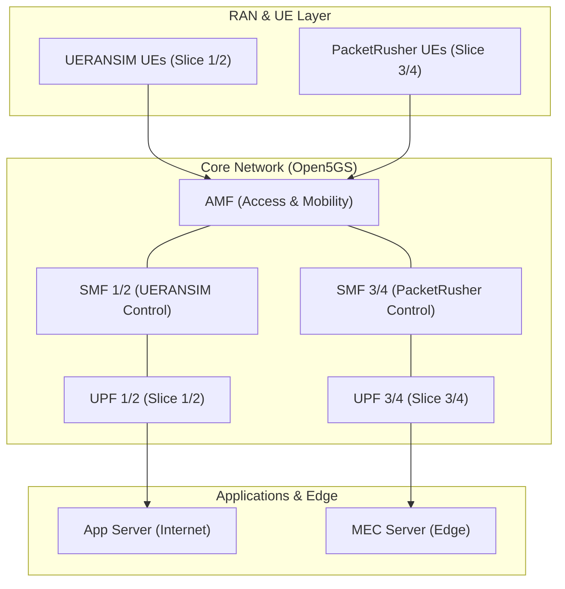

<h1 align="center">Open5GS-Slice-Aware-Telemetry-Platform</h1>

<!-- PROJECT LOGO -->

  M.Eng. Information Technology  

| Name of Contributor   |  
|-----------------------|  
| M M Rauf Shahriyar    |   
 

---

## Table of Contents
* [Introduction](#1-introduction)
* [System Architecture](#2-system-architecture)
* [Verified Design](#3-verified-design)
     - [Core Versions and Environment](#31-core-versions-and-environment)
     - [AMF Slice Advertisement](#32-amf-slice-advertisement)
     - [SMF and UPF Decomposition](#33-smf-and-upf-decomposition)
     - [RAN and UE Traffic Roles](#34-ran-and-ue-traffic-roles)
* [Functional Architecture](#4-functional-architecture)
* [Project Demonstrations](#5-project-demonstrations)
     - [Safe, Evidence-backed Results](#51-safe-evidence-backed-results)
     - [Results to be Validated](#52-results-to-be-validated)
     - [Testing](#53-testing)
* [Accessing Control Centers](#6-accessing-control-centers)
* [Project Limitations](#7-project-limitations)
* [Conclusion](#8-conclusion)

---

## 1. Introduction
This project introduces a **5G standalone slice-aware observability platform** utilizing Open5GS, UERANSIM, PacketRusher, and a custom telemetry dashboard. The setup demonstrates a **four-slice core architecture**, where the AMF advertises **four S-NSSAI entries**, and the core network is divided into **four SMFs and four UPFs** to ensure independent control-plane and user-plane paths for different traffic profiles. The system integrates telemetry collection with live dashboard control, core-topology visualization, and automated test-result export.

### Key Capabilities:
- Network slicing within a 5G SA core,
- Slice-specific traffic steering,
- Heterogeneous UE traffic generation,
- MEC versus internet-path comparison,
- Real-time observability with demonstrable routing proof.

---

## 2. System Architecture

The system architecture is built around a disjoint signaling and data paths model, as shown below:

---

## 3. Verified Design

### 3.1 Core Versions and Environment
The project depends on the following software versions:

- **Open5GS**: `v2.7.6`
- **UERANSIM**: `v3.2.7`
- **PacketRusher**: `main`
- **MongoDB**: `6.0`
